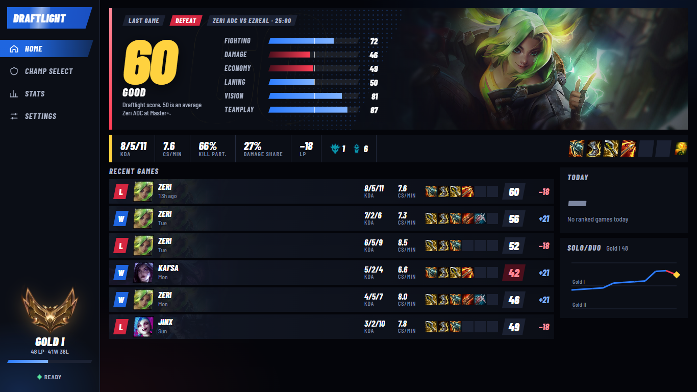
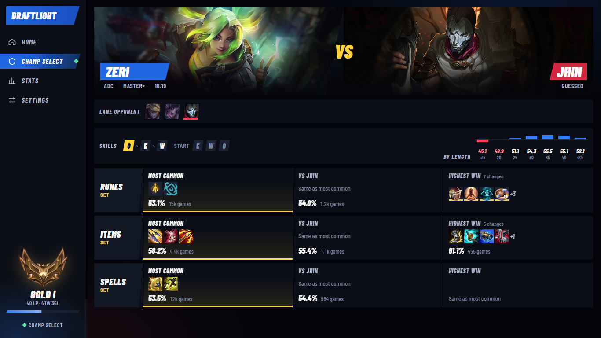
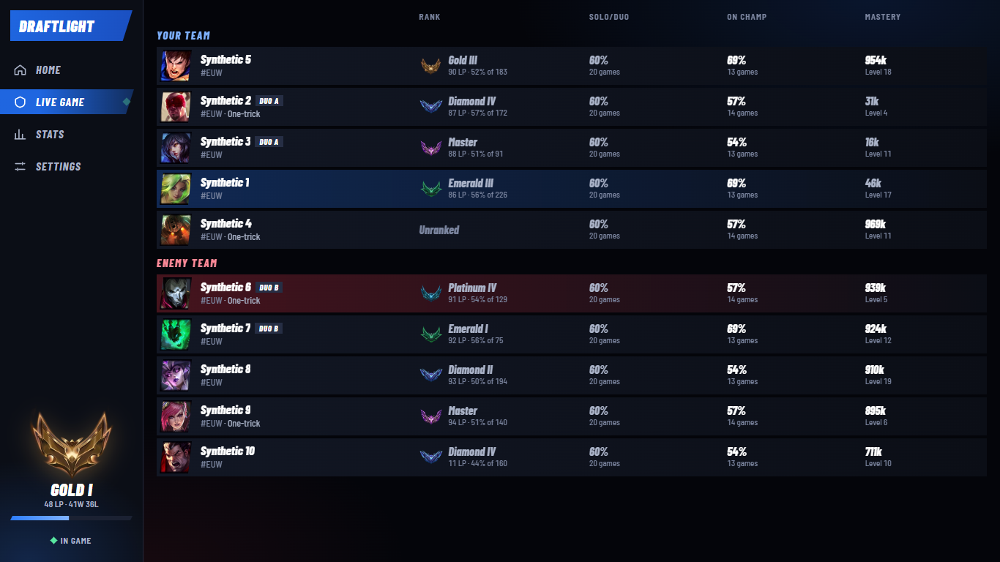
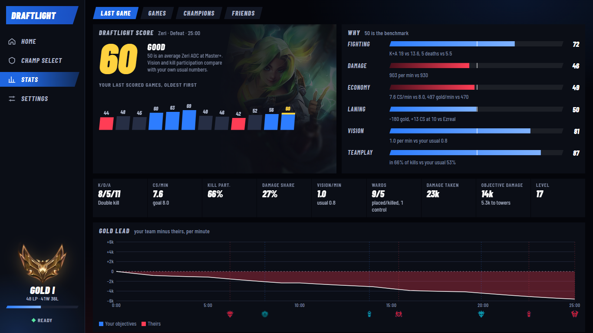

# Draftlight

A small League of Legends helper for Windows. It sits in the tray, sets your runes, summoner spells and
item set in champ select, shows the ten players on the loading screen and your CS per minute in game.

Draftlight is in the Microsoft Store as "Draftlight App":
https://apps.microsoft.com/detail/9NLCZN3C0JVC

It installs and updates through the Store. There is nothing to download from this page.

The players in this picture are made up.

Already have the copy from GitHub? Install the Store version; a copy from 1.3.0 on hands over to it by
itself. With an older copy, close it and delete it first.

[Privacy policy](PRIVACY.md)

Draftlight was created under Riot Games' "Legal Jibber Jabber" policy using assets owned by Riot Games.
Riot Games does not endorse or sponsor this project.

Draftlight isn't endorsed by Riot Games and doesn't reflect the views or opinions of Riot Games or anyone
officially involved in producing or managing Riot Games properties. Riot Games, and all associated
properties are trademarks or registered trademarks of Riot Games, Inc.
